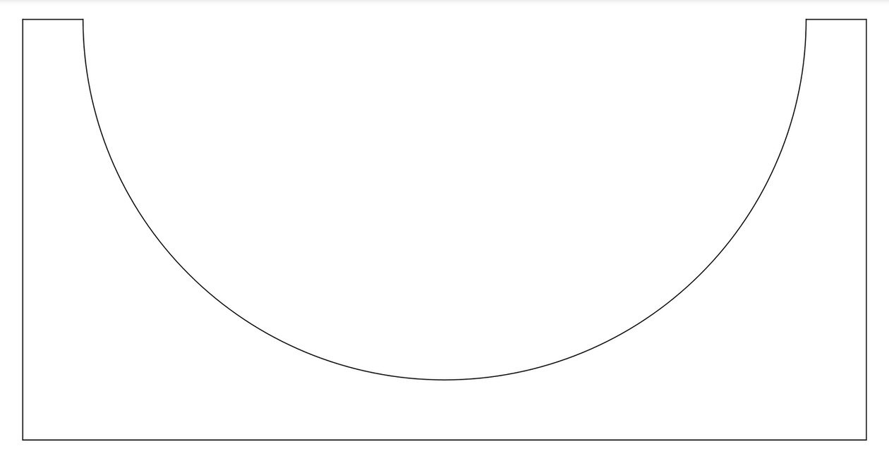

As shown in the figure, a block with a semicircular groove is initially at rest on a horizontal floor.
mass $=M$, radius $=R$.

```math
M=u m,\quad u\in(0,+\infty)
```

A small ball, modeled as a point particle of mass $m$, starts from the upper-left end of the semicircular groove with an initial velocity $\overrightarrow{v}_0$ directed vertically downward.

Let the horizontal plane through the ball’s initial position be the zero-potential-energy plane.

```math
E_{p,m}=-mgh
```

All contacting surfaces are frictionless.

Find $h$ at which the ball’s speed reaches its maximum.
