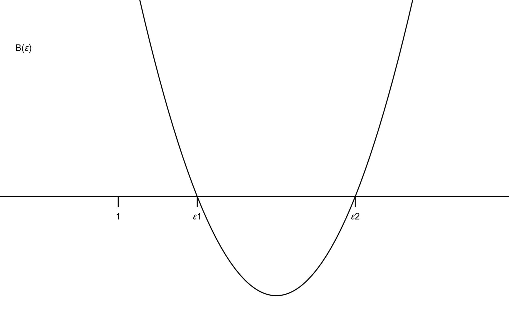
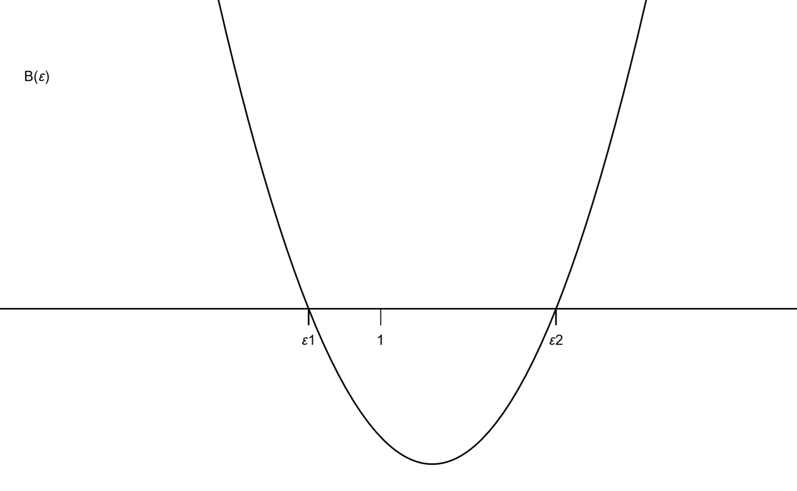

As shown in the figure, a block with a semicircular groove is initially at rest on a horizontal floor.
mass $=M$, radius $=R$.

```math
M=u m,\quad u\in(0,+\infty)
```

A small ball, modeled as a point particle of mass $m$, starts from the left top end of the semicircular groove with an initial velocity $\overrightarrow{v}_0$ directed vertically downward.

Let the horizontal plane through the ball’s initial position be the zero-potential-energy plane.

```math
E_{p,m}=-mgh
```

All contacting surfaces are frictionless.

Find $h$ at which the ball’s speed reaches its maximum.

---

if $M=2m,\ |\overrightarrow{v}_0|=0$

```math
0=\frac12 m v_{\text{abs}}^2+(-mgh)+\frac12(2m)v_{\text{tra}}^2
```

```math
h=R\sin\theta
```

```math
\theta \in [0, \frac{\pi}{2}]
```

$`\displaystyle \overrightarrow{v}_{\text{abs}}=\overrightarrow{v}_{\text{tra}}+\overrightarrow{v}_{\text{rel}}`$

$\displaystyle \forall h\in(0,R):$

$`\displaystyle \overrightarrow{v}_{\text{tra}}=-|\overrightarrow{v}_{\text{tra}}|\hat{\mathbf{x}},\qquad \overrightarrow{p}_{\text{sys}}\cdot\hat{\mathbf{x}}=0`$

$\therefore \displaystyle \overrightarrow{v}_{\text{abs}}\cdot\hat{\mathbf{x}}>0$


$\displaystyle \forall h\in[0,R]:$

```math
v_{\text{tra}}^2+v_{\text{rel}}^2-2|\overrightarrow{v}_{\text{tra}}||\overrightarrow{v}_{\text{rel}}|\cos\left(\frac{\pi}{2}-\theta\right)=v_{\text{abs}}^2
```

```math
(2m)|\overrightarrow{v}_{\text{tra}}|=m\left(|\overrightarrow{v}_{\text{rel}}|\sin\theta-|\overrightarrow{v}_{\text{tra}}|\right)
```

We obtain

```math
v_{\text{abs}}^2=\left(\frac{2g}{3}\right)\left(\frac{9R^2h-5h^3}{3R^2-h^2}\right)
```

Let $\lambda=\frac{h}{R}\in[0,1]$

```math
v_{\text{abs}}^2=\frac{2gR}{3}\cdot\frac{\lambda(9-5\lambda^2)}{3-\lambda^2}
```

$v_{\text{abs}}^2(\lambda)$ is continuous on $[0,1]$ and differentiable on $(0,1)$

```math
h_{\text{optimal}}=\sqrt{\frac{18-3\sqrt{21}}{5}}\,R\approx0.92R
```

---

if $M=um,\ |\overrightarrow{v}_0|\ge0$

```math
u\in(0,+\infty),\ h\in[0,R]
```

```math
h=R\sin\theta
```

```math
v_{\text{tra}}^2+v_{\text{rel}}^2-2|\overrightarrow{v}_{\text{tra}}||\overrightarrow{v}_{\text{rel}}|\cos\left(\frac{\pi}{2}-\theta\right)=v_{\text{abs}}^2
```

```math
\frac12 m v_0^2=\frac12 m v_{\text{abs}}^2+(-mgh)+\frac12(um)v_{\text{tra}}^2
```

```math
(um)|\overrightarrow{v}_{\text{tra}}|=m\left(|\overrightarrow{v}_{\text{rel}}|\sin\theta-|\overrightarrow{v}_{\text{tra}}|\right)
```

These yield

```math
v_{\text{abs}}^2=(2gh+v_0^2)\frac{(u+1)^2R^2-(2u+1)h^2}{(u+1)\left[(u+1)R^2-h^2\right]}
```

$v_{\text{abs}}^2(h)$ is continuous on $[0,R]$ and differentiable on $(0,R)$

```math
\frac{d}{dh}\left(v_{\text{abs}}^2\right)=\frac{2g}{(u+1)\left[(u+1)R^2-h^2\right]^2}\left[(2u+1)h^4-(u+1)(5u+2)R^2h^2-u(u+1)\frac{v_0^2R^2}{g}h+(u+1)^3R^4\right]
```

Let $f(h)=(2u+1)h^4-(u+1)(5u+2)R^2h^2-u(u+1)\frac{v_0^2R^2}{g}h+(u+1)^3R^4$

```math
\left\{h\in[0,R]\;\middle|\;v_{\text{abs}}^2(h)=\max_{h\in[0,R]}v_{\text{abs}}^2\right\}\subseteq\left\{h\in[0,R]\;\middle|\;f(h)=0\right\}\cup\{0,R\}
```

```python
from numpy.polynomial import Polynomial


def find_real_roots_in_range(u, r, v_0, g):
    a_0 = (u + 1) ** 3 * r**4
    a_1 = -u * (u + 1) * (v_0**2 * r**2) / g
    a_2 = -(u + 1) * (5 * u + 2) * r**2
    a_3 = 0.0
    a_4 = 2 * u + 1

    complex_roots = Polynomial([a_0, a_1, a_2, a_3, a_4]).roots()

    return [
        float(root.real)
        for root in complex_roots
        if abs(root.imag) < 1e-12 and 0.0 <= root.real <= r
    ]


def compute_v_squared(h, u, r, v_0, g):
    num = (2 * g * h + v_0**2) * ((u + 1) ** 2 * r**2 - (2 * u + 1) * h**2)
    den = (u + 1) * ((u + 1) * r**2 - h**2)

    return num / den


def find_optimal_h(u, r, v_0, g):
    real_roots_in_range = find_real_roots_in_range(u, r, v_0, g)
    h_set = {0.0, r, *real_roots_in_range}

    h_v_squared_pairs = [(h, compute_v_squared(h, u, r, v_0, g)) for h in h_set]

    optimal_h, _ = max(h_v_squared_pairs, key=lambda pair: pair[1])

    return optimal_h, h_v_squared_pairs


def main():
    u = float(input("u = "))
    r = float(input("r = "))
    v_0 = float(input("v_0 = "))
    g = float(input("g = "))

    if not (u > 0 and r > 0 and v_0 >= 0 and g > 0):
        print("invalid input")
        return

    print()

    optimal_h, h_v_squared_pairs = find_optimal_h(u, r, v_0, g)

    for h, v_squared in sorted(h_v_squared_pairs, key=lambda pair: pair[0]):
        print(f"h = {h:.6f}, v_squared = {v_squared:.6f}")

    print()
    print("optimal_h")
    print(f"{optimal_h:.6f}")


if __name__ == "__main__":
    main()
```

```markdown
u = 2
r = 1
v_0 = 0
g = 9.8

h = 0.000000, v_squared = 0.000000
h = 0.922201, v_squared = 13.307593
h = 1.000000, v_squared = 13.066667

optimal_h
0.922201
```

---

if $M=um,\ |\overrightarrow{v}_0|=0$

```math
v_{\text{abs}}^2=(2gh)\frac{(u+1)^2R^2-(2u+1)h^2}{(u+1)\left[(u+1)R^2-h^2\right]}
```

Let $\varepsilon=\left(\frac{h}{R}\right)^2\in[0,1]$

```math
v_{\text{abs}}^2=(2gR)\sqrt{\varepsilon}\cdot\frac{(u+1)^2-(2u+1)\varepsilon}{(u+1)(u+1-\varepsilon)}
```

$v_{\text{abs}}^2(\varepsilon)$ is continuous on $[0,1]$ and differentiable on $(0,1)$

```math
\frac{d}{d\varepsilon}v_{\text{abs}}^2=(2gR)\frac{(2u+1)\varepsilon^2-(u+1)(5u+2)\varepsilon+(u+1)^3}{2\sqrt{\varepsilon}(u+1)(u+1-\varepsilon)^2}
```

$\displaystyle \forall\varepsilon\in(0,1):\quad\operatorname{sgn}\left(\frac{d}{d\varepsilon}v_{\text{abs}}^2\right)=\operatorname{sgn}(B(\varepsilon))$

```math
B(\varepsilon)=(2u+1)\varepsilon^2-(u+1)(5u+2)\varepsilon+(u+1)^3
```

$\because u\in(0,+\infty)$,

```math
\therefore 2u+1>0,\quad\Delta=u(17u+8)(u+1)^2>0
```

$B(\varepsilon)=0$ has exactly two distinct real roots:

```math
\varepsilon_1=\frac{u+1}{2(2u+1)}\left(5u+2-\sqrt{u(17u+8)}\right)
```

```math
\varepsilon_2=\frac{u+1}{2(2u+1)}\left(5u+2+\sqrt{u(17u+8)}\right)
```

```math
\varepsilon_1<\varepsilon_2
```

```python
In [1]: u = symbols('u')

In [2]: epsilon_1 = (u + 1) / (2 * (2 * u + 1)) * (5 * u + 2 - sqrt(u * (17 * u + 8)))

In [3]: epsilon_2 = (u + 1) / (2 * (2 * u + 1)) * (5 * u + 2 + sqrt(u * (17 * u + 8)))

In [4]: solveset(epsilon_1 > 0, u, Interval.open(0, oo))
Out[4]: (0, ∞)

In [5]: solveset(epsilon_1 > 1, u, Interval.open(0, oo))
Out[5]: (1 + √3, ∞)

In [6]: solveset(epsilon_2 > 1, u, Interval.open(0, oo))
Out[6]: (0, ∞)
```

For all $u\in(0,+\infty)$, $\varepsilon_1(u)>0$ and $\varepsilon_2(u)>1$.

Case 1:

$\displaystyle \varepsilon_1\in(1,+\infty)$



$\displaystyle \forall\varepsilon\in(0,1):\quad B(\varepsilon)>0\Longrightarrow\frac{d}{d\varepsilon}v_{\text{abs}}^2>0\Longrightarrow v_{\text{abs}}^2\nearrow\text{ on }[0,1]$

Case 2:

$\displaystyle \varepsilon_1\in(0,1)$



$\displaystyle \forall\varepsilon\in(0,\varepsilon_1):\quad B(\varepsilon)>0\Longrightarrow\frac{d}{d\varepsilon}v_{\text{abs}}^2>0\Longrightarrow v_{\text{abs}}^2\nearrow\text{ on }[0,\varepsilon_1]$

$\displaystyle \forall\varepsilon\in(\varepsilon_1,1):\quad B(\varepsilon)<0\Longrightarrow\frac{d}{d\varepsilon}v_{\text{abs}}^2<0\Longrightarrow v_{\text{abs}}^2\searrow\text{ on }[\varepsilon_1,1]$

Case 3:

$\displaystyle \varepsilon_1\in\{1\}$

$\displaystyle \forall\varepsilon\in(0,1):\quad B(\varepsilon)>0\Longrightarrow\frac{d}{d\varepsilon}v_{\text{abs}}^2>0\Longrightarrow v_{\text{abs}}^2\nearrow\text{ on }[0,1]$

Cases 1, 2, 3 imply

```math
\varepsilon=\min\{1,\varepsilon_1\}
```

```math
h_{\text{optimal}}=R\cdot\min\left\{1,\sqrt{\frac{u+1}{2(2u+1)}\left(5u+2-\sqrt{u(17u+8)}\right)}\right\}
```
